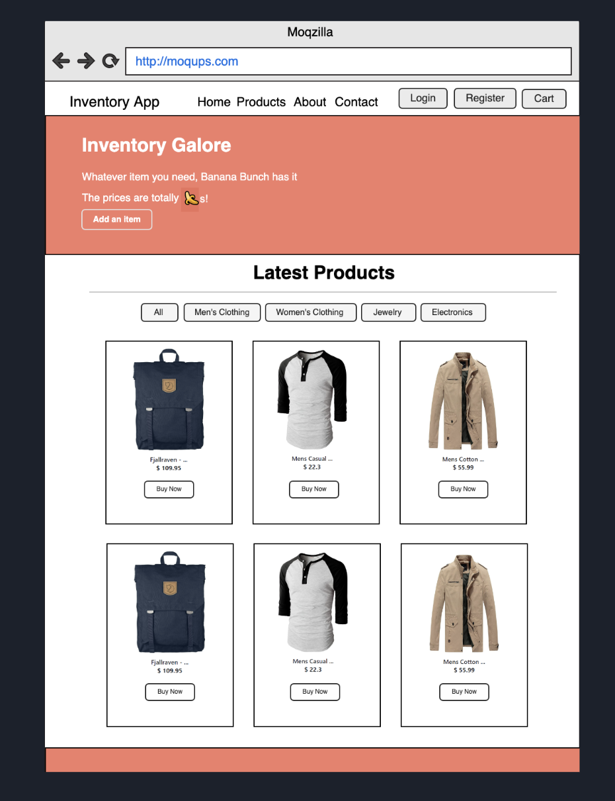

## Project #1
Give a high-level overview of the project purpose
- This application is an application that customers can use to purchase the products for sale from our inventory.
- This application was designed so that we could retrieve the product in our warehouse that we wanted to sell and show it to our cusotmers in a more appealing way with images and the ability to add items to our cart and checkout once they are ready to pay.
- In order to create this application we used React to create components such as the cart, form, Nav bar, single item view, etc. This allowed us to separate all the working parts of the application to view specific items when we clicked on them and add them to the cart if the customer wants to purchase the item.
- As a result, we were able to bring the wireframe below to life and made it look even better than we hoped. This showcased the items that we added to our inventory app. 

## Technologies
- JavaScript
- React - Version 18.2.0
- React Bootstrap - Version 2.5.0
- Redux - Version 4.2.0
- Sqlite3 - Version 5.0.11

## Competencies
### JF 6.4 
- Works independently and takes responsibility. For example, has a disciplined and responsible approach to risk, and stays motivated and committed when facing challenges
- During this group project I was able to independently contribute to my team by creating the single view for each item and writing the express route to get all the items
- In order to accomplish this I had to focus on making sure that I was able to select an item that ws available and then display solely that item on a new page.  
- Being able to get this feature done allowed myself and my team to meet one of the requirements of the project and allowed me to learn and put to practice the technologies that we had been learning in our cohort.
- Although this was a bit tough for me to figure out at first, I was able to stay motived and stick to getting the part I was responsible for done.

### JF 6.6
- Shows initiative for solving problems within their own remit, being resourceful when faced with a problem to solve
- As I mentioned before, I did have a bit of trouble at the beginning getting my part figured out, but I used my resources and went back to look at a previous example we had worked on in coding rooms and figured it out from there. 
- In order to get this accomplished, I first had to figure out the part that I was stuck on so that I knew what to look for in the previous examples. Once I figure out the part I needed help with then I could go back and see what was done previously anf make the connection between the previous work and what I was trying to accomplish now. Once that got figured out I was able to figure out how my part would need to be set up to work. 
- From this action that I took, I was able to really see howuseful it is to use the resources that are out there. I was able to figure things out on my own without having to reach out to my team for help. 
- The way I approached this small problem I faced, showed that I was willing and able to take initiative for trying to solve a problem on my own by using the resources available to me. 