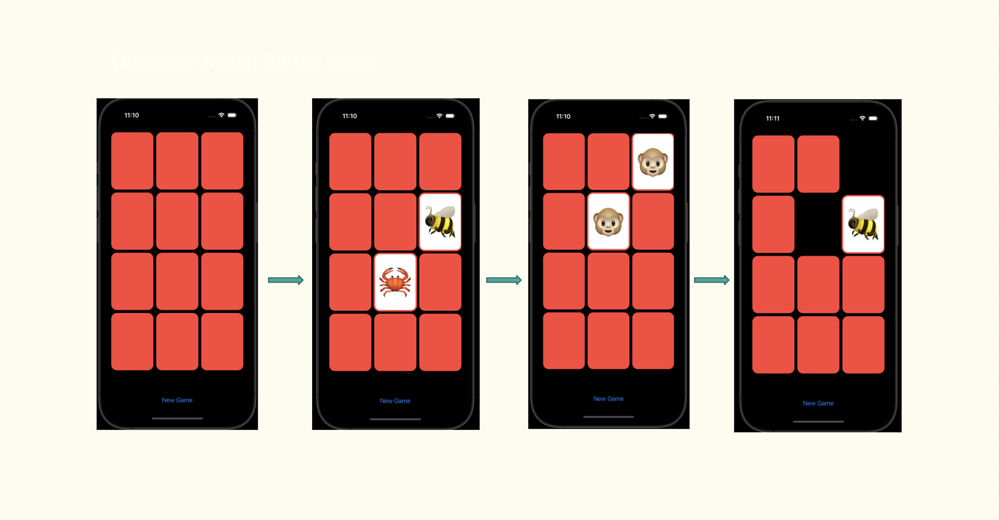

## Project #2
The purpose of this application was to put together a fun game written in a different language from what we learned in our bootcamp. 
- I created this application because I wanted to learn Swift language since it's what I would be using in my job at Verizon, and I thought a fun first project would be a game. 
- I decided to create a matching card game that would work on mobile devices. Once a player flipped cards that were matching then those cards would disappear so that they could only choose the ones that were not matched yet. If they picked cards that did not match, they would be turned back around to the red side. 
- To this application, I first had to learn some Swift language. Once I got some understanding of it, I was able to start on my project and with the help of videos on YouTube and Google I was able to put a matching game together. 

## Technologies
- Swift - Version 16.3
- Wrote on Xcode

## Competencies
### JF 2.5
- Can implement a responsive User Interface
- For this project I was able to create a responsive user interface by connecting UI to logic on another file.
- In order to figure out how to connect the logic to the cards I had to watch a couple of videos and figure things out through trial and error. 
- The outcome of this project was that I got to experience working with a new language and really challenged myself to step outside of my comfort zone. 
- Creating a responsive user interface created a smooth and easy use for the game that I created. This allows people to really enjoy playing this game.

### JF 2.6
- Can translate wireframes into User Interfaces 
- I was able to demonstrate this when I had to start off with a wireframe of what the game needed to look like and then put it together piece by piece.
- In order to accomplish this, I started with what I knew the game should look like and slowly started adding components until we got to the final product of what it needed to look like. I did have to watch some videos here and there and some examples and play around with the cards a bit to get the final look I wanted.
- It is important to be able to bring something that starts as a wireframe to life because as developers we need to learn to look at what the design team gives us and make it look that same way. 
- This project allowed me to practice this competency and taught me to pay attention to detail and work from a visual product.