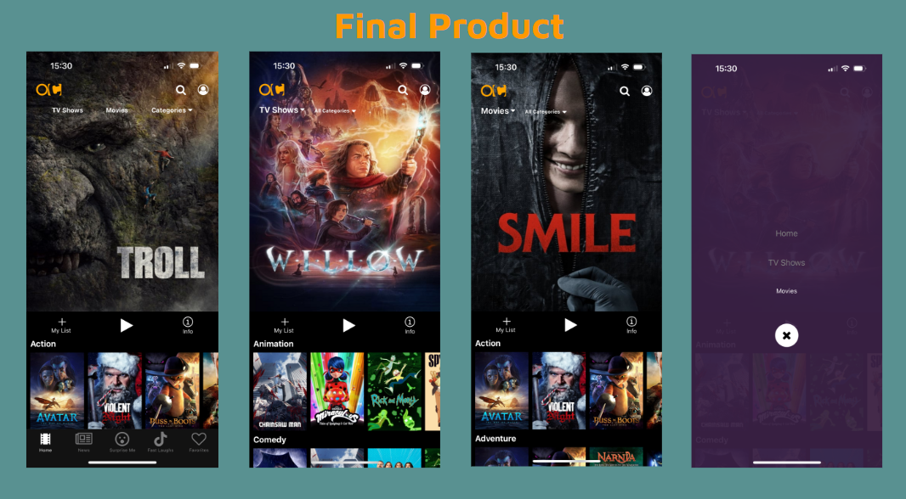

## Project #3
Give a high-level overview of the project purpose
- This application is a mobil app that shows you moveis anf Tv shows as well as allows you to add the ones you would like to your favorites list to keep them handy for when you would like to watch them.
- We decided to create a Netflix App clone that worked on mobile devices using React Native. In order to make this happen first, my parter Giovanni Lituma (giovannixdev) and I needed to learn React Native to create the front end. We then Partnered with Edgard Gamoboa(maestrogamboa) as well to add the backend.
- In order to produce the application we wanted I helped by creating the front end of half of the items on the home screen, the tv shows screen, as well as helping create the routes and functionality to connect the backend and add favorite movies to a customer's favorites list. 

## Technologies
- Express 4.17.1
- Sequelize 6.17.0
- React Native
- TypeScript 4.1.3

## Competencies
### JF 3.3
- Can link code to data sets
- For this project I got to work with Edgard to take data that the user clicked on to add to their favorites list and store that data for that user. 
- To accomplish this we had to get the data from the API and add each movie/tv show that was clicked on to the empty user list and store this in the database for each user.  
- This allowed us to personalize the experience for different users on each of their accounts and gave us the opportunity to get some practice with using a database to store our own information. 
- Taking the code that was pulled from the API and connecting it to our new data sets was a challenge at first since we had some issues with figuring out how the primary keys related to each user and movies, but we were able to figure it out after some time. 

### JF 3.4
- Can create a logical and maintainable codebase
- We created a codebase that gets updated with the API that we used and will therfore pull in the movies/tv shows that are currently out. 
- In order to create code that was logical and maintainable we made suer that we used variables and code that made sense to others people in case someone else at some point looked at the code and needed to figure out how we wrote it. We also made sure that we used an API that is being maintained so that the information stays current.
- The end result really taught us how to create a full stack project where we used out own database to store the information that we need.
- It is important to create logical and maintainable code so that in a project like this one, we are getting current information from out API and so that everything gets displayed correctly as well as is understandable to others in case in the future something needs to be changed or updated. 